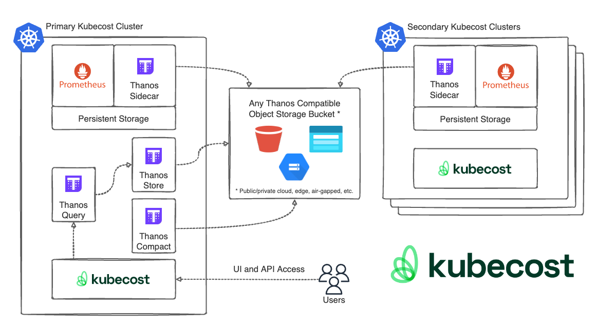

# Kubecost Setup for OpenShift

## Overview

This repository is designed to be an easy guide for the most common configurations of Kubecost in OpenShift clusters and may be used where cluster security requirements are more locked down than is typical in standard distributions. It does not replace our [published documentation](https://guide.kubecost.com/) which will have details for many more use cases.

The Kubecost version used in this helm cart uses GA release containers. The primary difference are helm templates have been modified to allow securityContext configuration changes and additional value-file templates.

---

### Single Cluster Deployment:

[Kubecost OpenShift Installation Guide](./README-install-guide.md)

In this solution, Kubecost is installed with Cost Analyzer and Prometheus as a time-series database. Data is gathered by the Prometheus installed with Kubecost (user-defined Prometheus). Other metrics are scraped by user-defined Prometheus from OCP monitoring stack managed components like KSM, OSM, CAdvisor, etc .... Kubecost then push and query metrics to/from user-defined Prometheus. Enterprise set up could also work with Thanos as additional component.

The standard deployment is illustrated in the following diagram:

### Multi Cluster Deployment:

*Multi Cluster is an Enterprise Feature*

Kubecost uses a hub and spoke model to aggregate multiple cluster metrics into a single-pane-of-glass.

In this model a single cluster will act as the primary which presents a UI and API access to all cluster data.

[Kubecost OpenShift Installation Guide](./README-install-guide.md)

### Grafana managed Prometheus deployment:

*Multi Cluster is an Enterprise Feature*

In this solution, Kubecost is installed with the core components only (cost model, frontend) without user-defined Prometheus and other components. Grafana agent is installed as part of the solution to scrape the metrics from OCP monitoring stack managed components and Kubecost `/metrics` endpoint to write the data back to the Grafana Cloud managed Prometheus (Grafana Prometheus) instance. Kubecost reads the metrics directly from Grafana managed Prometheus.

[Grafana Cloud Guide](./README-grafana-cloud.md)

The Grafana managed Prometheus deployment is illustrated in the following diagram:

---
## Support

For advanced setup or if you have any questions, you can contact us on [Slack](https://join.slack.com/t/kubecost/shared_invite/enQtNTA2MjQ1NDUyODE5LWFjYzIzNWE4MDkzMmUyZGU4NjkwMzMyMjIyM2E0NGNmYjExZjBiNjk1YzY5ZDI0ZTNhZDg4NjlkMGRkYzFlZTU) or email at team@kubecost.com

To participate in our free Enterprise onboarding program, contact us at support@kubecost.com to schedule these sessions!
